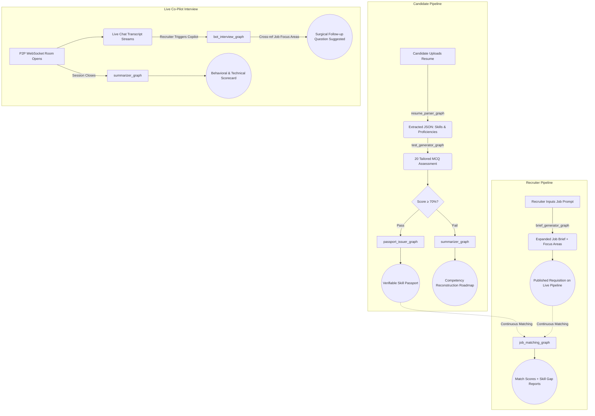

<div align="center">

# ⬡ SkillBridge
### Agentic AI Recruitment Platform

[](https://opensource.org/licenses/Apache-2.0)
[](https://python.org)
[](https://fastapi.tiangolo.com)
[](https://reactjs.org)
[](https://typescriptlang.org)
[](https://langchain-ai.github.io/langgraph/)

**Stop relying on unverified paper. SkillBridge deploys autonomous AI agents at every stage of the recruitment pipeline — from resume parsing to live co-pilot interviews.**

[Live Demo](#demo-accounts) · [Quick Start](#quick-start) · [Architecture](#architecture) · [Tech Stack](#tech-stack)

</div>

---

## Overview

SkillBridge solves the modern hiring problem by deploying **7 specialized autonomous AI agents** at every step of the recruitment flow. From instantly parsing resumes and generating tailored assessments, to issuing verifiable **Skill Passports** and powering a **Live Co-Pilot Interview Room** — the platform eliminates bias, reduces recruiter fatigue, and ends candidate ghosting.

### For Candidates
- Upload your resume → AI extracts skills and auto-generates a **20-question tailored assessment**
- Pass (≥70%) → Receive a verifiable **Skill Passport** matched against live job requisitions
- Fail → Receive a structured **Competency Reconstruction Roadmap** with curated learning resources and a retake window

### For Recruiters
- Input a job title → AI **expands it** into a full Job Brief with skill requirements and focus areas
- Skip manual screening — only passport-holding, pre-verified candidates surface in your pipeline
- During interviews, an AI **Co-Pilot agent** listens to the live transcript and suggests precision follow-up questions tailored to your job focus areas

---

## Screenshots

### 🔐 Landing Page


---

### 👤 Candidate Experience

**Live Job Feed** — Skill Passport auto-aligns against active requisitions with match scores


**Resume Parsing Terminal** — Drag & drop resume for deep-layer AI skill extraction


**Profile Ledger** — Candidate identity and academic profile configuration


**Competency Reconstruction Roadmap** — Structured learning nodes with curated resources for failed assessments


---

### 🏢 Recruiter Experience

**Live Pipeline** — Manage all active recruitment requisitions and their candidate nodes


**Talent Match Search** — AI-matched candidate pool ranked by Skill Passport alignment


**Create Talent Node (Initialize Position)** — AI-powered job brief builder with skill verification matrix


---

## Demo Accounts

The app runs in **demo mode** (in-memory session store) with pre-seeded accounts — no database setup required.

| Role | Email | Password |
|------|-------|----------|
| Candidate | `candidate@demo.com` | `password` |
| Recruiter | `recruiter@demo.com` | `password` |

---

## Quick Start

### Prerequisites
- **Node.js** v18+
- **Python** 3.9+
- An **OpenAI API Key** (GPT-4o)
- Supabase account *(optional — for persistent storage; app runs fully in-memory without it)*

### 1. Clone the Repository

```bash
git clone https://github.com/your-username/skillbridge.git
cd skillbridge
```

### 2. Backend Setup

```bash
cd backend

# Create and activate a virtual environment
python -m venv venv

# Windows
venv\Scripts\activate

# macOS / Linux
source venv/bin/activate

# Install dependencies
pip install -r requirements.txt

# Configure environment variables
cp .env.example .env
# Edit .env and fill in your OPENAI_API_KEY and (optionally) Supabase credentials
```

### 3. Frontend Setup

```bash
cd frontend
npm install
```

### 4. Run the Application

Open **two terminal windows**:

**Terminal 1 — Backend (FastAPI)**
```bash
cd backend
# Activate venv first (see above)
uvicorn app.main:app --reload --host 0.0.0.0 --port 8000
```

**Terminal 2 — Frontend (Vite + React)**
```bash
cd frontend
npm run dev
```

The app will be live at **[http://localhost:5173](http://localhost:5173)**. All frontend API requests are automatically proxied to the backend at port 8000.

---

## Environment Variables

Create a `.env` file in the `backend/` directory. Use `.env.example` as a template:

| Variable | Required | Description |
|----------|----------|-------------|
| `OPENAI_API_KEY` | ✅ Yes | GPT-4o API key powering all agent graphs |
| `SUPABASE_URL` | Optional | Supabase project URL for persistent storage |
| `SUPABASE_KEY` | Optional | Supabase anon/service key |
| `SUPABASE_RESUME_BUCKET` | Optional | Supabase Storage bucket name for resume PDFs |
| `JWT_SECRET_KEY` | Optional | Secret for JWT token signing (defaults to a dev key) |
| `DEMO_MODE` | Optional | Set to `true` to force in-memory session store |

---

## Architecture

SkillBridge orchestrates **7 autonomous agents** using **LangGraph** stateful graph execution:



### Agent Registry

| Agent File | Role | Trigger |
|---|---|---|
| `resume_parser_graph.py` | Extracts structured skill JSON from PDF via GPT-4o | Resume upload |
| `test_generator_graph.py` | Dynamically generates 20 tailored MCQs from skill JSON | Post-parse |
| `passport_issuer_graph.py` | Issues verifiable Skill Passport for passing candidates | Score ≥ 70% |
| `summarizer_graph.py` | Generates Competency Roadmap with curated resources | Score < 70% |
| `brief_generator_graph.py` | Expands recruiter's job prompt into full structured brief | Job creation |
| `job_matching_graph.py` | Computes GPT-4o match scores between passports & jobs | Continuous |
| `bot_interview_graph.py` | Suggests precision follow-up questions during live interview | Recruiter trigger |

---

## Tech Stack

### Frontend
| Technology | Purpose |
|---|---|
| **React 18 + TypeScript** | Component-based UI with strict type safety for complex AI state |
| **Vite** | High-performance bundler with instant HMR |
| **Tailwind CSS** | Utility-first styling with dynamic animations |
| **Zustand** | Lightweight global auth state management |
| **TanStack Query** | Data fetching, caching, and background polling |
| **Lucide React** | Consistent, scalable icon library |

### Backend
| Technology | Purpose |
|---|---|
| **FastAPI (Python)** | Async API framework with native WebSocket support |
| **LangGraph + LangChain** | Stateful graph-based autonomous agent orchestration |
| **OpenAI GPT-4o** | Powers all 7 agentic reasoning and generation nodes |
| **Supabase / PostgreSQL** | Relational storage with real-time capabilities (optional) |
| **python-jose** | JWT authentication and session management |

### Real-Time & Networking
| Technology | Purpose |
|---|---|
| **WebSockets** | Low-latency bidirectional streams for live interview transcript and AI suggestions |
| **WebRTC (P2P)** | Peer-to-peer audio/video in the interview room — routed via Google STUN servers, zero media server cost |
| **HTTP REST** | Standard CRUD, auth flows, and job/candidate management |

---

## Project Structure

```
skillbridge/
├── backend/
│   ├── app/
│   │   ├── main.py                  # FastAPI entry point, CORS, router mounts, demo seed
│   │   ├── config.py                # Centralized settings and environment config
│   │   ├── agents/
│   │   │   └── graphs/              # All 7 LangGraph agent definitions
│   │   │       ├── resume_parser_graph.py
│   │   │       ├── test_generator_graph.py
│   │   │       ├── passport_issuer_graph.py
│   │   │       ├── summarizer_graph.py
│   │   │       ├── brief_generator_graph.py
│   │   │       ├── job_matching_graph.py
│   │   │       └── bot_interview_graph.py
│   │   ├── routers/                 # FastAPI route handlers
│   │   │   ├── auth.py              # JWT login & registration
│   │   │   ├── candidates.py        # Profile, resume upload, roadmap
│   │   │   ├── recruiters.py        # Company profile, job ownership
│   │   │   ├── jobs.py              # Job board, matching analytics
│   │   │   ├── tests.py             # MCQ submission & evaluation
│   │   │   ├── interviews.py        # WebSocket LiveInterviewManager + WebRTC signaling
│   │   │   └── proctoring.py        # (Reserved) Anti-cheat proctoring WebSocket
│   │   └── services/
│   │       ├── supabase.py          # Supabase client singleton
│   │       ├── auth_middleware.py   # JWT dependency for protected routes
│   │       ├── email_service.py     # SMTP notification service
│   │       └── session_store.py     # In-memory mock DB for demo/dev mode
│   ├── .env.example                 # Environment variable template
│   ├── requirements.txt             # Python dependencies
│   ├── admin_seed.py                # Seeds admin accounts to Supabase
│   ├── seed_demo.py                 # Seeds demo candidate/recruiter data
│   ├── setup_db.py                  # Supabase schema initialization helper
│   └── supabase_schema.sql          # Full Postgres schema (tables, RLS policies)
│
├── frontend/
│   ├── src/
│   │   ├── App.tsx                  # React Router — candidate vs recruiter route isolation
│   │   ├── store/
│   │   │   └── authStore.ts         # Zustand global auth state
│   │   ├── services/
│   │   │   └── api.ts               # Axios instance with Bearer token injection
│   │   └── pages/
│   │       ├── candidate/
│   │       │   ├── Layout.tsx        # Candidate nav sidebar wrapper
│   │       │   ├── Jobs.tsx          # Live Job Feed with passport alignment scores
│   │       │   ├── ResumeUpload.tsx  # Drag-and-drop resume parsing terminal
│   │       │   ├── TestTaker.tsx     # MCQ assessment renderer
│   │       │   ├── PassportView.tsx  # Skill Passport success / Roadmap recovery
│   │       │   └── BotInterview.tsx  # Candidate WebRTC engine (getUserMedia, SDP Answer)
│   │       └── recruiter/
│   │           ├── Dashboard.tsx     # Live Pipeline — requisition management
│   │           ├── JobList.tsx       # Job cards with real-time candidate polling
│   │           ├── CreateJob.tsx     # AI-powered job brief wizard
│   │           └── LiveSession.tsx   # Recruiter WebRTC host (SDP Offer, ICE, Co-Pilot panel)
│   ├── index.html
│   ├── vite.config.ts
│   └── package.json
│
├── docs/
│   └── screenshots/                 # Application screenshots for README
│
├── Dockerfile                       # Production Docker image
├── .env.example                     # Root-level env template
└── README.md
```

---

## Key Features Deep Dive

### 🔍 Intelligent Resume Parsing
Upload any PDF resume → GPT-4o runs structured extraction, identifying technical skills, frameworks, experience levels, and educational background → Returns normalized JSON consumed by downstream agents.

### 📋 Adaptive Assessment Engine
No fixed question bank. Every 20-question test is **dynamically generated** from the candidate's own extracted skill profile, ensuring assessments are always relevant, fair, and un-gameable.

### 🛂 Verifiable Skill Passports
A persistent, structured credential issued upon passing. Passports contain extracted skill sets, assessment scores, and timestamps — continuously matched against active job requisitions by the `job_matching_graph`.

### 🗺️ Competency Reconstruction Roadmap
Candidates who fail don't hit a dead end. The `summarizer_graph` analyzes their skill gaps, constructs a prioritized learning module sequence, and links to curated external resources — complete with a retake eligibility window.

### 🎯 AI Job Matching
The `job_matching_graph` continuously computes deep semantic match scores (0–100) between Skill Passports and active job requisitions using GPT-4o reasoning — surfacing ranked candidates with detailed gap analytics for recruiters.

### 🎙️ Live Co-Pilot Interview Room
A peer-to-peer audio/video interview room powered by WebRTC and WebSocket signaling. Recruiters trigger the `bot_interview_graph` mid-interview — the agent reads the live transcript, cross-references the job's focus areas, and returns a targeted follow-up question in real time.

---

## Roadmap

| Feature | Status |
|---|---|
| AI Proctoring (webcam eye-tracking + off-screen detection) | 🔜 Planned |
| Monaco Editor sync (live coding exercises in interview room) | 🔜 Planned |
| Voice-Mode Autonomous Interviews (OpenAI Realtime Audio API) | 🔜 Planned |
| Calendar Booking Engine (Google OAuth2 scheduling) | 🔜 Planned |
| Multi-tenant enterprise workspace support | 🔜 Planned |

---

## License

Licensed under the [Apache 2.0 License](LICENSE).

---

<div align="center">
Built with LangGraph · FastAPI · React · GPT-4o
</div>
